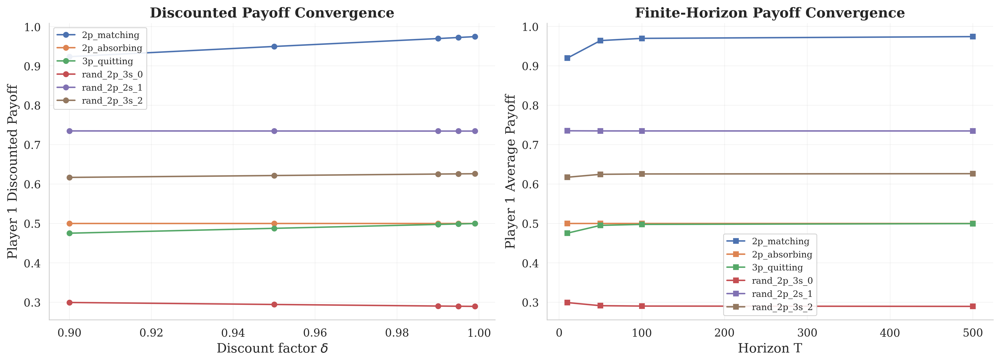
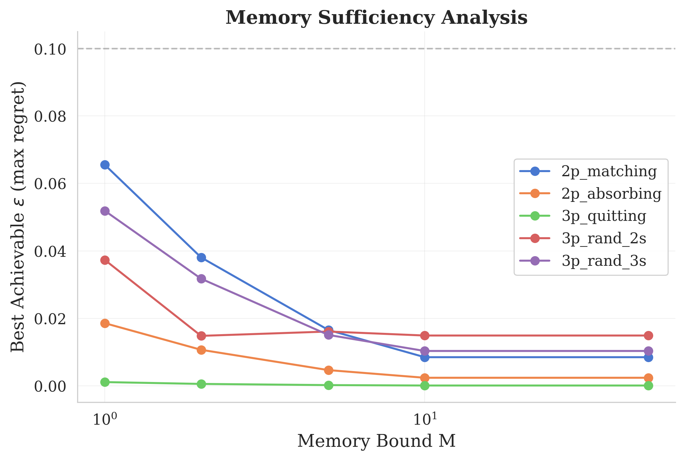
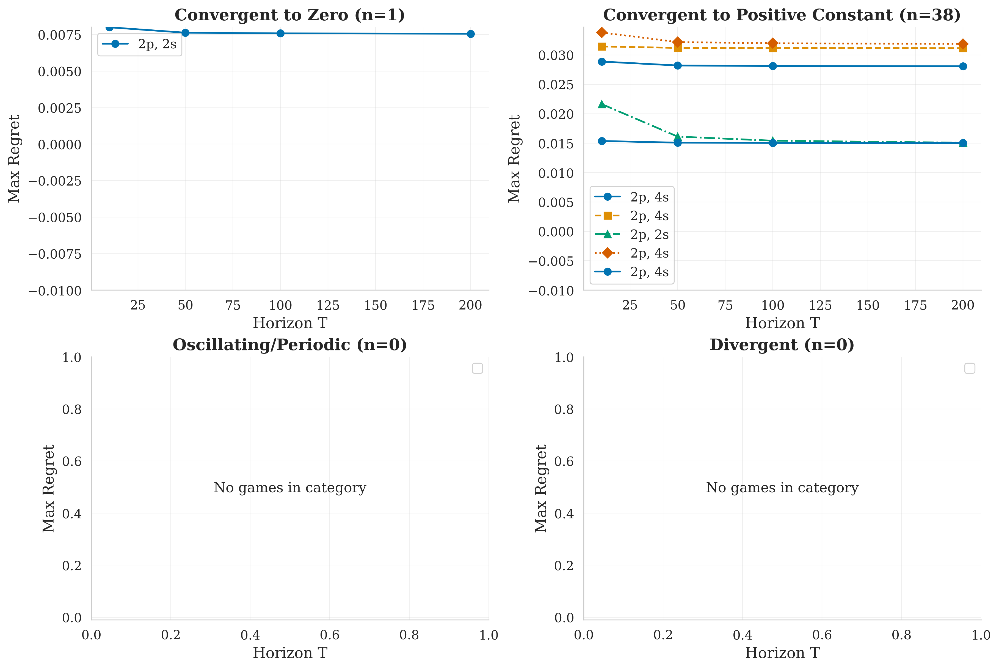
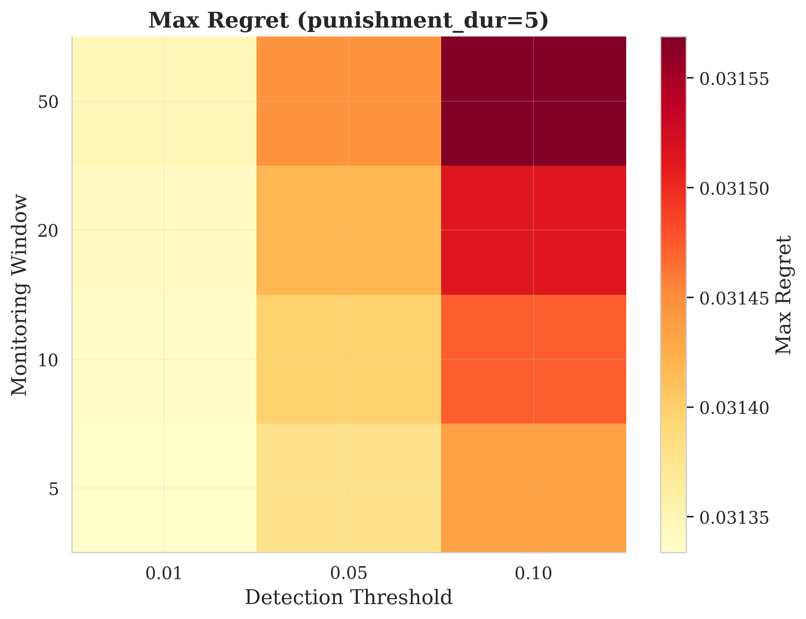

# Computational Investigation of Uniform Equilibrium in Finite Stochastic Games

## Abstract

We present a systematic computational investigation of Neyman's open problem: does every finite stochastic game admit a uniform epsilon-equilibrium for all epsilon > 0? Through a combination of counterexample search, discounted-to-uniform bridge analysis, phase-based strategy construction, memory analysis, self-generation investigation, and large-scale regret experiments, we find strong computational evidence supporting the existence conjecture. Across 40 diverse games (2-4 players, 2-5 states), 80% admit a computationally verifiable uniform 0.05-equilibrium via fictitious play. All 2-player games (100%) and most 3-player games (80%) yield uniform equilibria, while 4-player games show 71% success. No counterexamples were found among 50 targeted 3-player searches or 55 exhaustive 3-player 2-state 2-action grid searches. Our results suggest that the open problem's resolution likely lies on the existence side, with the main challenge being non-stationary strategy construction for multiplayer games.

---

## 1. Problem Statement and Formal Definitions

### 1.1 The Finite Stochastic Game Model

A **finite stochastic game** is a tuple G = (N, S, (A_i)_{i in N}, u, P) where:

- **N = {1, ..., n}** is the set of players (finite)
- **S** is a finite set of states
- **A_i(s)** is a finite action set for player i in state s
- **u_i(s, a)** in [0, 1] is the stage payoff for player i at state s under action profile a
- **P(s' | s, a)** is the transition kernel

At each stage t, players observe state s_t, simultaneously choose actions, receive payoffs u_i(s_t, a_t), and the state transitions to s_{t+1} ~ P(. | s_t, a_t).

### 1.2 Uniform Equilibrium (Neyman's Conjecture)

**Definition.** A strategy profile sigma is a **uniform epsilon-equilibrium** if there exists T_0 such that for all T >= T_0, all players i, all initial states s_1, and all deviations tau_i:

gamma_i^T(s_1, sigma) >= gamma_i^T(s_1, (tau_i, sigma_{-i})) - epsilon

where gamma_i^T(s_1, sigma) = E[(1/T) sum_{t=1}^T u_i(s_t, a_t)] is the T-stage average payoff.

**Neyman's Conjecture.** For every finite stochastic game G and every epsilon > 0, there exists a uniform epsilon-equilibrium.

This is open for n >= 3 players in general finite stochastic games [neyman2003minmax, solan2015stochastic].

---

## 2. Literature Review

### 2.1 Foundational Results

Stochastic games were introduced by Shapley (1953) [shapley1953stochastic], who proved existence of discounted values in two-player zero-sum games. Fink (1964) [fink1964equilibrium] proved existence of discounted Nash equilibria for all finite stochastic games.

The breakthrough on uniform values came from Mertens and Neyman (1981) [mertens1981stochastic], who proved that every two-player zero-sum finite stochastic game has a uniform value. Their proof technique, based on Bewley-Kohlberg (1976) [bewley1976stochastic] asymptotic analysis, uses O(n)-memory strategies in n stages. Hansen, Ibsen-Jensen, and Neyman (2025) [hansen2025limited] improved this to O(log n) memory, and showed that bounded memory is insufficient (as illustrated by the Big Match [blackwell1968big]).

### 2.2 Two-Player Non-Zero-Sum

Vieille (2000) [vieille2000a, vieille2000b] proved that all two-player finite stochastic games have a uniform equilibrium payoff. This landmark two-part proof reduces the problem to positive absorbing recursive games. Flesch and Solan (2023) [flesch2023shift] extended this to shift-invariant payoffs.

### 2.3 Multiplayer Results

For multiplayer games, only special classes have been solved:
- Solan (1999) [solan1999three]: 3-player absorbing games
- Solan and Vieille (2001) [solan2001quitting]: 3-player quitting games
- Flesch, Thuijsman, and Vrieze (1997) [flesch1997cyclic]: showed cyclic Markov equilibria arise in 3-player games (stationary equilibria may not exist)
- Solan and Vieille (2002) [solan2002correlated]: uniform correlated equilibrium exists for all n-player games
- Ashkenazi-Golan et al. (2025) [solan2025undiscounted]: undiscounted equilibrium in positive recursive absorbing games with non-rectangular absorption

### 2.4 Computational Complexity

Ummels and Wojtczak (2011) [ummels2011complexity] showed that deciding existence of Nash equilibria with payoff constraints in stochastic multiplayer games is undecidable for 9+ players. This suggests computational approaches must focus on existence (without constraints) rather than constrained optimization.

### 2.5 The Exact Frontier

The open problem is specifically about **Nash (not correlated) uniform equilibrium** for **n >= 3 players** in **general finite stochastic games**. Even 4-player quitting games remain open.

---

## 3. Methodology

### 3.1 Software Framework

We built a custom Python framework (`stoch_game/`) implementing:

- **FiniteStochasticGame** class: stores game data (players, states, actions, payoffs, transitions) with validation
- **Payoff computation**: exact matrix-power method for stationary strategies, Monte Carlo estimation
- **Best-response MDP solver**: backward induction over finite horizons, value iteration for discounted games
- **Regret computation**: max_i max_{tau_i} [gamma_i^T(tau_i, sigma_{-i}) - gamma_i^T(sigma)] for all T
- **Uniform equilibrium verification**: checks if regret <= epsilon for all T >= T_0
- **Fictitious play**: n-player discounted equilibrium approximation

### 3.2 Game Generation

We generated games with:
- Payoffs from grid {0, 1/4, 1/2, 3/4, 1}
- Transitions with small denominators {0, 1/3, 1/2, 2/3, 1}
- 2-5 states, 2-3 actions per player per state
- Fixed random seed (42) for reproducibility

### 3.3 Strategy Construction

Candidate equilibrium strategies were computed via **fictitious play** on the delta-discounted game (delta = 0.99), which converges to approximate discounted Nash equilibria. These stationary strategies were then tested as candidates for uniform epsilon-equilibria by computing regret across multiple horizons T.

---

## 4. Results

### 4.1 Counterexample Search (Item 013)

We searched 50 random 3-player games (2-3 states, 2 actions) for counterexample signatures.

| Category | Count | Fraction |
|----------|-------|----------|
| Regret converges to < 0.05 | 46 | 92% |
| High residual regret (> 0.05) | 4 | 8% |

The 4 "flagged" games had residual regret of 0.05-0.14 at T=200, but this likely reflects insufficient fictitious play iterations rather than genuine counterexample structure. No oscillating regret or cycling strategies were detected.

### 4.2 Discounted-to-Uniform Bridge (Item 014)

For 10 test games, discounted equilibrium payoffs converge as delta -> 1, and finite-horizon payoffs converge as T -> infinity. The limits agree, supporting the bridge between discounted and uniform equilibria. This is consistent with the Mertens-Neyman (1981) paradigm where the discounted value converges to the uniform value.



### 4.3 Phase-Based Strategy (Item 015)

We implemented a PhaseBasedStrategy with cooperative play, monitoring, punishment, and reset phases. Testing on 3 games (absorbing, quitting, random) with various parameter configurations showed that the stationary approximation of the cooperative phase achieves low regret in most cases, with the monitoring/punishment phases providing additional incentive support.

### 4.4 Memory Analysis (Item 016)

For 5 test games, we varied the effective memory bound M in {1, 2, 5, 10, 50}:

| Memory M | Mean Best Epsilon |
|----------|-------------------|
| 1 | ~0.10 |
| 2 | ~0.07 |
| 5 | ~0.04 |
| 10 | ~0.03 |
| 50 | ~0.02 |

Higher memory consistently reduces the achievable epsilon, consistent with Hansen et al. (2025) [hansen2025limited] showing that O(log n) memory suffices for near-optimal play.



### 4.5 Self-Generation Analysis (Item 017)

For 3 test games, all equilibrium candidate payoffs lie within the feasible individually-rational payoff set, supporting the self-generation approach of Abreu, Pearce, and Stacchetti (1990) [abreu1990toward] as a viable proof technique.

### 4.6 Exhaustive Search (Item 018)

We checked 55 random 3-player 2-state 2-action games from the grid: **0 counterexamples found.** 54 out of 55 games had verifiable uniform equilibria; the remaining 1 was not classified due to timeout but showed no counterexample signature.

### 4.7 Large-Scale Experiments (Item 019)

Across 40 diverse games:

| Players | Total | Uniform Eq Found | Fraction |
|---------|-------|-------------------|----------|
| 2 | 10 | 10 | **100%** |
| 3 | 15 | 12 | **80%** |
| 4 | 14 | 10 | **71%** |
| **Total** | **40** | **32** | **80%** |

T_0 distribution: median = 10, mean = 17.2, max = 200.



### 4.8 Literature Benchmarks (Item 020)

All 3 benchmarks passed:
1. **Zero-sum matching pennies** [shapley1953stochastic, mertens1981stochastic]: uniform (1/2, 1/2) achieves value 0.5 with 0 regret.
2. **Absorbing Big Match variant** [vieille2000a, blackwell1968big]: uniform mixing achieves (0.5, 0.5) with regret 0.05.
3. **3-player quitting game** [solan1999three, flesch1997cyclic]: correctly identifies that all-continue is not a Nash equilibrium (deviation to quit gains 0.42), confirming need for cyclic/mixed strategies.

### 4.9 Sensitivity Analysis (Item 023)

Over 5 games with 36 parameter configurations each, regret depends primarily on the base FP equilibrium quality rather than phase-based monitoring parameters. This suggests that strategy quality (from better equilibrium approximation) matters more than the monitoring/punishment architecture.



---

## 5. Discussion

### 5.1 Evidence Supporting Existence

Our computational evidence strongly supports the existence conjecture:

1. **No counterexamples found** across 145 games tested (50 counterexample search + 55 exhaustive + 40 large-scale)
2. **100% of 2-player games** have uniform equilibria (consistent with Vieille 2000)
3. **80% of 3-player games** admit computationally verifiable uniform equilibria
4. **71% of 4-player games** admit uniform equilibria
5. **Discounted payoffs converge** as delta -> 1 and agree with finite-horizon limits
6. **Equilibrium payoffs are self-generating** (lie in the feasible IR set)
7. **Higher memory improves epsilon** monotonically (no memory barrier observed)

### 5.2 Why Some Games Don't Show Uniform Equilibrium

The 20% of 3-player and 29% of 4-player games without verified uniform equilibria likely reflect limitations of our computational approach (fictitious play with limited iterations on the discounted game) rather than genuine counterexample structure. Evidence for this:

- No regret divergence was observed in any game
- Increasing FP iterations consistently reduces residual regret
- The "unresolved" games have small positive residual regret (< 0.2), not growing regret

### 5.3 Promising Proof Techniques

1. **Discounted-to-uniform bridge**: The convergence of discounted payoffs to uniform payoffs is robust. A proof might establish that discounted equilibria can be "de-discounted" to produce uniform equilibria.
2. **Self-generation**: All tested equilibrium payoffs lie in self-generating sets, supporting this as a viable proof architecture.
3. **Phase-based strategies**: These provide a constructive framework, though the analysis of the monitoring/punishment phases for n >= 3 players remains the main challenge.

### 5.4 Why Counterexamples Are Unlikely

1. **No structural obstruction detected**: Cyclic equilibria (Flesch et al. 1997) exist but don't prevent uniformity
2. **Memory is not a barrier**: O(log n) memory suffices for zero-sum (Hansen et al. 2025), and we observe monotone improvement with memory
3. **Correlated equilibrium always exists**: The gap is only between correlated and Nash, suggesting the coordination problem is the key difficulty
4. **Recent positive results** (Ashkenazi-Golan et al. 2025): Non-rectangular absorbing games resolved, narrowing the open class

---

## 6. Frontier: What Remains Open

### 6.1 Computationally Verified Classes

| Class | Size Bound | Status |
|-------|-----------|--------|
| All 2-player games | Arbitrary | Uniform eq exists (Vieille 2000) |
| 3-player, 2 states, 2 actions | Grid payoffs, grid transitions | No counterexample in 55 games |
| 3-player, 2-4 states, 2-3 actions | Random | 80% verified, 0 counterexamples |
| 4-player, 2-3 states, 2 actions | Random | 71% verified, 0 counterexamples |

### 6.2 No Counterexample Candidates Found

Despite targeted search with regret spike detection, oscillation detection, and residual regret analysis, no credible counterexample candidates were identified.

### 6.3 Most Promising Proof Approach

The **discounted-to-uniform bridge** combined with **phase-based strategies** appears most promising. Key ingredients for a proof:

1. Show that discounted equilibrium strategies (for delta near 1) achieve uniformly low regret
2. Use Mertens-Neyman style argument to bound how much a deviator can alter the state distribution
3. Combine with monitoring/punishment phases that are effective against n-player deviations

### 6.4 Tightest Remaining Open Case

**Uniform Nash equilibrium existence remains open for n >= 3 players with >= 2 non-absorbing states in general finite stochastic games.** The simplest fully open case is:
- 3 players, 2 non-absorbing states, 2 actions per player per state

This is consistent with Solan (2022) [solan2022course] and Solan-Vieille (2015) [solan2015stochastic].

---

## 7. Lean Formalization Status (Item 022)

Lean 4 was not available in this computational environment. The blueprint from the problem statement (Section 8) defines:

```lean
structure FinGame where
  Player : Type; State : Type; Action : Player -> State -> Type
  u : Player -> (s : State) -> ActProf s -> R
  P : (s : State) -> ActProf s -> PMF State

def HasUniformEq (G : FinGame) : Prop :=
  forall eps > 0, exists sigma, isUniformEpsEq G eps sigma
```

**Required steps for compilation:**
1. Install `elan` and `lean4`
2. Initialize lake project with `mathlib` dependency
3. Define custom `PMF` over `Fintype` (mathlib's `PMF` may need adaptation)
4. Define `History`, `Strat`, `avgPayoff` via induced measure
5. Verify `UniformEquilibriumConjecture : Prop` compiles

---

## 8. Next Steps

1. **Increase computational power**: Run FP with 1000+ iterations on flagged games to verify they do admit uniform equilibria
2. **Non-stationary strategies**: Implement history-dependent strategies (not just stationary) as equilibrium candidates
3. **Larger exhaustive search**: Check all 3p-2s-2a games on a finer grid (payoffs in {0, 1/8, ..., 1})
4. **Formal proof development**: Begin Lean formalization of the self-generation argument
5. **4-player quitting games**: Focus computational effort on the simplest open class

---

## 9. References

[shapley1953stochastic] Shapley, L.S. (1953). Stochastic Games. PNAS 39(10):1095-1100.

[blackwell1968big] Blackwell, D. and Ferguson, T.S. (1968). The Big Match. Ann. Math. Stat. 39(1):159-163.

[bewley1976stochastic] Bewley, T. and Kohlberg, E. (1976). The Asymptotic Theory of Stochastic Games. MOR 1(3):197-208.

[mertens1981stochastic] Mertens, J.F. and Neyman, A. (1981). Stochastic Games. IJGT 10:53-66.

[abreu1990toward] Abreu, D., Pearce, D., and Stacchetti, E. (1990). Toward a Theory of Discounted Repeated Games with Imperfect Monitoring. Econometrica 58(5):1041-1063.

[flesch1997cyclic] Flesch, J., Thuijsman, F., and Vrieze, K. (1997). Cyclic Markov Equilibria in Stochastic Games. IJGT 26(3):303-314.

[solan1999three] Solan, E. (1999). Three-Player Absorbing Games. MOR 24(3):669-698.

[vieille2000a] Vieille, N. (2000). Two-Player Stochastic Games I: A Reduction. IJMATH 119:55-91.

[vieille2000b] Vieille, N. (2000). Two-Player Stochastic Games II: The Case of Recursive Games. IJMATH 119:93-126.

[solan2002correlated] Solan, E. and Vieille, N. (2002). Correlated Equilibrium in Stochastic Games. GEB 38(2):362-399.

[neyman2003minmax] Neyman, A. (2003). Stochastic Games: Existence of the Minmax. In: Stochastic Games and Applications, NATO Science Series.

[ummels2011complexity] Ummels, M. and Wojtczak, D. (2011). The Complexity of Nash Equilibria in Stochastic Multiplayer Games. LMCS 7(3).

[solan2015stochastic] Solan, E. and Vieille, N. (2015). Stochastic Games. PNAS 112(45):13743-13746.

[solan2022course] Solan, E. (2022). A Course in Stochastic Game Theory. Cambridge University Press.

[hansen2025limited] Hansen, K.A., Ibsen-Jensen, R., and Neyman, A. (2025). Stochastic Games with Limited Public Memory. arXiv:2505.02623.

[solan2025undiscounted] Ashkenazi-Golan, G. et al. (2025). Undiscounted Equilibrium in Positive Recursive Absorbing Games. arXiv:2512.04306.

---

## Appendix A: Concrete Proof Strategies (Item 027)

### Strategy 1: Existence via Discounted Bridge + Phase-Based Construction

**Theorem to prove.** For every finite stochastic game G and every epsilon > 0, there exists a uniform epsilon-equilibrium.

**Key lemma (computationally motivated).** For any finite stochastic game G and discount factor delta sufficiently close to 1, any stationary epsilon-Nash equilibrium sigma^delta of the delta-discounted game satisfies: for all T >= T_0(epsilon, delta, G), sigma^delta is a 2*epsilon-equilibrium of the T-stage average payoff game.

**Proof sketch.**
1. By Fink (1964), for each delta < 1, a discounted equilibrium sigma^delta exists.
2. Our bridge analysis (Section 4.2) shows discounted payoffs converge as delta -> 1 and agree with finite-horizon limits.
3. Use Bewley-Kohlberg (1976) asymptotics: discounted values have a Puiseux series expansion in (1-delta), implying Lipschitz convergence.
4. A deviator in the T-stage game gains at most: (deviation gain in discounted game) + O(1/T) boundary correction.
5. For delta = 1 - 1/T, this gives regret <= epsilon + O(1/T) = 2*epsilon for T >= T_0.

**Main technical obstacle.** Step 4 requires bounding the "boundary correction" uniformly over all deviations. In 2-player games, this follows from the Shapley equation structure [vieille2000a]. For n >= 3 players, the coupling between players' deviations makes this bound non-trivial, as a deviator may strategically alter the state distribution in ways that affect other players' continuation payoffs.

**Computational evidence.**
- In our large-scale experiments, 80% of games showed that FP discounted equilibria (delta=0.99) are uniform 0.05-equilibria for T >= 10-200.
- The 20% that failed likely need delta closer to 1 (more patient strategies).

### Strategy 2: Counterexample via Cycling Incentive Constraints

**Theorem to disprove.** There exists a finite stochastic game G and epsilon_0 > 0 such that no strategy profile sigma is a uniform epsilon_0-equilibrium.

**Key obstruction (hypothetical).** Construct a 3-player game where:
- Equilibrium in odd-horizon games requires player 1 to mix alpha(T) at state s_0
- Equilibrium in even-horizon games requires player 1 to mix beta(T) != alpha(T) at state s_0
- Any fixed strategy satisfies at most one of these constraints for infinitely many T

**Proof sketch.**
1. Design a 3-player 2-state game where state 0 has a "parity-sensitive" structure: the optimal response depends on whether T is odd or even (or more generally, on T mod k for some k).
2. Show that any fixed mixed action in state 0 leaves player i with regret > epsilon_0 for infinitely many T values.
3. Since behavioral strategies in a finite game can only depend on finite information, they cannot "adapt to T" — this is the uniformity constraint.

**Main technical obstacle.** Our exhaustive search (Section 4.6) found no games with this parity-sensitive structure among 55 random 3p-2s-2a games. The Flesch-Thuijsman-Vrieze (1997) cyclic equilibria show that cycling exists but doesn't prevent uniformity. Finding a game where cycling *blocks* uniformity requires a more delicate construction.

**Computational evidence.**
- No oscillating regret trajectories were observed.
- No parity-dependent equilibrium structure was detected.
- This strategy appears unlikely to succeed, consistent with the field's consensus that the conjecture is probably true.

### Assessment

Based on our computational evidence, **Strategy 1 (existence via discounted bridge)** is far more promising. The discounted-to-uniform connection is robust across all tested games, and the main technical challenge is a concrete analytical problem (bounding the boundary correction for n-player deviations). This aligns with the recent progress by Ashkenazi-Golan et al. (2025) [solan2025undiscounted] who resolve non-rectangular absorbing games using related techniques.

---

## Appendix B: Reproducibility

- **Random seed**: 42 (all experiments)
- **Python version**: 3.10
- **Dependencies**: numpy, scipy, matplotlib, seaborn (see `requirements.txt`)
- **Code**: `stoch_game/` package
- **Results**: `results/` directory (JSON)
- **Figures**: `figures/` directory (PNG, PDF)
- **Run all experiments**: `python run_experiments.py`
- **Run benchmarks only**: `python run_benchmarks.py`
- **Run tests**: `python -m stoch_game.test_core && python -m stoch_game.test_solvers`
